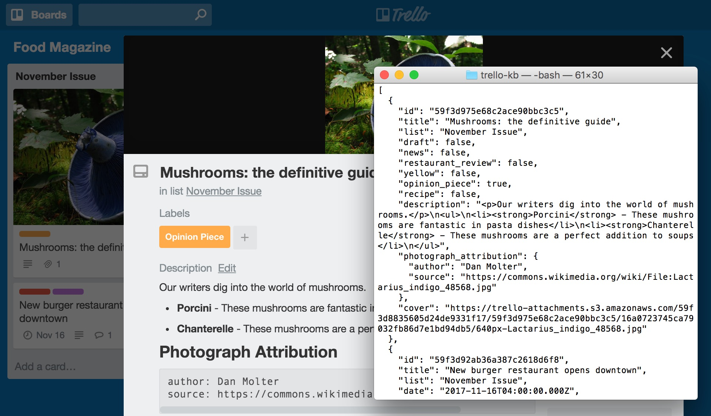

# Overview of Trello KB

Trello KB enables you to get a [Trello](https://trello.com) board as an array of content objects. The objects in the array correspond to the cards on the board.

For example, you could create a magazine in Trello, then use Trello KB to get a JSON version of each article:



Trello KB is not affiliated with Trello or Atlassian in any way.

## Main Features

Trello KB converts each card on the board to a self-contained object. The conversion process has the following main features:

- **Markdown+YAML → HTML and nested objects.** Trello lets you [use a flavor of markdown to format card descriptions](http://help.trello.com/article/821-using-markdown-in-trello). Trello KB converts the card description to HTML and places the result in the `description` property.
  
  If the card description contains level 1 headers, Trello KB returns a separate property for each level 1 header. If the only content that follows a level 1 header is a code block, Trello KB assumes that the code block contains YAML, then converts the YAML to an object.
  
  For example, if the card description is:
  
      This is a **card**

      # More Details
      - More text
      - _Even more_ text

      # Custom Data
      ```
      key: value
      array:
      - one
      - two
      ```

      # Summary
      Summary text
  
  Trello KB returns the following properties:
  
      "description": "<p>This is a <strong>card</strong></p>",
      "more_details": "<ul>\n<li>More text</li>\n<li><em>Even more</em> text</li>\n</ul>",
      "custom_data": {
        "key": "value",
        "array": [
          "one",
          "two"
        ]
      },
      "summary": "<p>Summary text</p>"
  
  > **NOTE:** Trello KB does not support [MSON](https://github.com/apiaryio/mson).

- **Labels → Booleans.** Trello lets you [add labels to cards](http://help.trello.com/article/797-adding-labels-to-cards). For each label on the board, Trello KB returns a Boolean property that indicates whether the card has the label.
  
  For example, if the card has a label called "Opinion Piece" and there is also an unnamed yellow label on the board, Trello KB returns the following properties:
  
      "yellow": false,
      "opinion_piece": true

# Get a Board

## Prerequisites

- You must have [Node.js](https://nodejs.org) and the `trello-kb` module installed. To install the `trello-kb` module using [npm](https://www.npmjs.com/), run the following command:
  
  ```shell
  npm install trello-kb
  ```

- You must have a Trello account. If you do not have a Trello account, create an account at https://trello.com/signup. If you are building a Trello integration, Trello recommends that you create a Trello account specifically for your integration.
  
  You will need to provide Trello KB with the application key of your Trello account. To view the application key of your Trello account, visit https://trello.com/app-key.

- You will need to provide Trello KB with an authorization token for a Trello account that has access to the board. See [Authorization](https://developers.trello.com/page/authorization) for how to request an authorization token. The authorization token must include the `read` scope.
  
  If your Trello account has access to the board, the simplest way to obtain a suitable authorization token is to visit the following URL:
  
      https://trello.com/1/authorize?key=APP_KEY&name=Test%20Integration&scope=read&expiration=never&response_type=token
  
  Replace `APP_KEY` by the application key of your Trello account.

- You will need to provide Trello KB with the ID of the board. You can obtain the ID from the URL of the board. For example, the ID of [this board](https://trello.com/b/dMFueFPQ/food-magazine) is `dMFueFPQ`.

## Example
```javascript
const trelloKB = require('trello-kb');

// Replace this by the application key of your Trello account
var appKey = '4dee095cf22f1793eb435fdac9e9ebec';

// Replace this by a valid authorization token
var authToken = 'ca1dd89c602cb34e8558d9451cdc7727855e3803d885aeb7b671bd64ac7d6bea';

// Get the board https://trello.com/b/dMFueFPQ/food-magazine
trelloKB.get(appKey, authToken, 'dMFueFPQ').then(
  function (cards) {

    // Print the title of each card
    cards.forEach(function (card) {
      console.log(card.title);
    });
  }
);
```

Output:

    Mushrooms: the definitive guide
    New burger restaurant opens downtown
    Shortage of ice cream causes panic across the city
    Make the perfect carrot cake
    How strawberries will transform the way you eat breakfast

See [doc/cards.json](doc/cards.json) for a JSON version of the `cards` array in this example.

# Card Object Reference
For each card on the board, Trello KB returns an object with the following properties:

| Property      | Description                                                                                                                                                                                                                                                                                                                                                                           |
|---------------|---------------------------------------------------------------------------------------------------------------------------------------------------------------------------------------------------------------------------------------------------------------------------------------------------------------------------------------------------------------------------------------|
| `id`          | <p>The Trello ID of the card.</p>                                                                                                                                                                                                                                                                                                                                                     |
| `title`       | <p>The card title.</p>                                                                                                                                                                                                                                                                                                                                                                |
| `list`        | <p>The name of the list that the card is in.</p>                                                                                                                                                                                                                                                                                                                                      |
| `cover`       | <p>The URL of the card cover.</p><p>Only available if [a cover image has been attached to the card](http://help.trello.com/article/769-adding-attachments-to-cards).</p>                                                                                                                                                                                                              |
| `date`        | <p>The due date of the card.</p><p>Only available if [a due date has been added to the card](http://help.trello.com/article/794-adding-due-dates-to-cards).</p>                                                                                                                                                                                                                       |
| `draft`       | <p>True if the card has a due date but the due date has not been marked as complete; false otherwise.</p>                                                                                                                                                                                                                                                                             |
| _label_       | <p>For each label on the board, a Boolean that indicates whether the card has the label. See [Main Features](#main-features).</p><p>You can use the [keyFromText](#keyfromtext) option to control how Trello KB converts label names to property names.</p>                                                                                                                           |
| `description` | <p>An HTML version of the card description that precedes level 1 headers. See [Main Features](#main-features).</p>                                                                                                                                                                                                                                                                    |
| _header_      | <p>For each level 1 header in the card description:</p><ul><li>an HTML version of the content that follows the header; or</li><li>the object described by the YAML code block that follows the header.</li></ul><p>See [Main Features](#main-features).</p><p>You can use the [keyFromText](#keyfromtext) option to control how Trello KB converts header text to property names.</p> |

You can use the [Trello REST API](https://developers.trello.com/v1.0/reference#cardsid) to get additional card details.

# Module Options

## getArchived
The `getArchived` option is a Boolean that specifies whether Trello KB gets archived cards. The default value is false, which means that Trello KB gets only the cards that are visible on the board.

To get all visible and archived cards:

```javascript
const trelloKB = require('trello-kb');

trelloKB.options.getArchived = true;
```

## keyFromText
The `keyFromText` option is a function that specifies how Trello KB converts label names and header text to property names. The default function returns names that contain only lower case letters, digits, and underscores. The default function may change in future releases of Trello KB.

To disable conversion of label names and header text:
```javascript
const trelloKB = require('trello-kb');

trelloKB.options.keyFromText = function (text) {
  return text;
};
```

> **NOTE:** Trello KB converts header text to plain text before applying `keyFromText`. To completely disable conversion for a particular header, surround the header text by backticks.

## headerMap
The `headerMap` option is a function that specifies how Trello KB handles level 2-6 headers in card descriptions. The default function maps level _N_ headers to level _N_ &minus; 1 headers, which means that level 2 headers in card descriptions become level 1 headers in the HTML that Trello KB returns.

To disable renumbering of headers:
```javascript
const trelloKB = require('trello-kb');

trelloKB.options.headerMap = function (level) {
  return level;
};
```