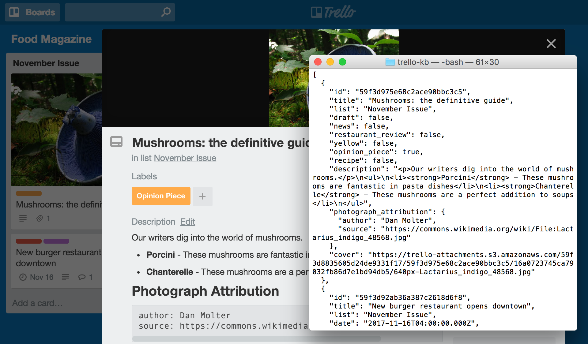

# Overview of Trello KB

Trello KB enables you to download a [Trello](https://trello.com) board as an array of reusable content objects. For example, you could produce a magazine in Trello, then use Trello KB to get a JSON version of each magazine article:

Trello KB is not affiliated with Trello or Atlassian in any way.